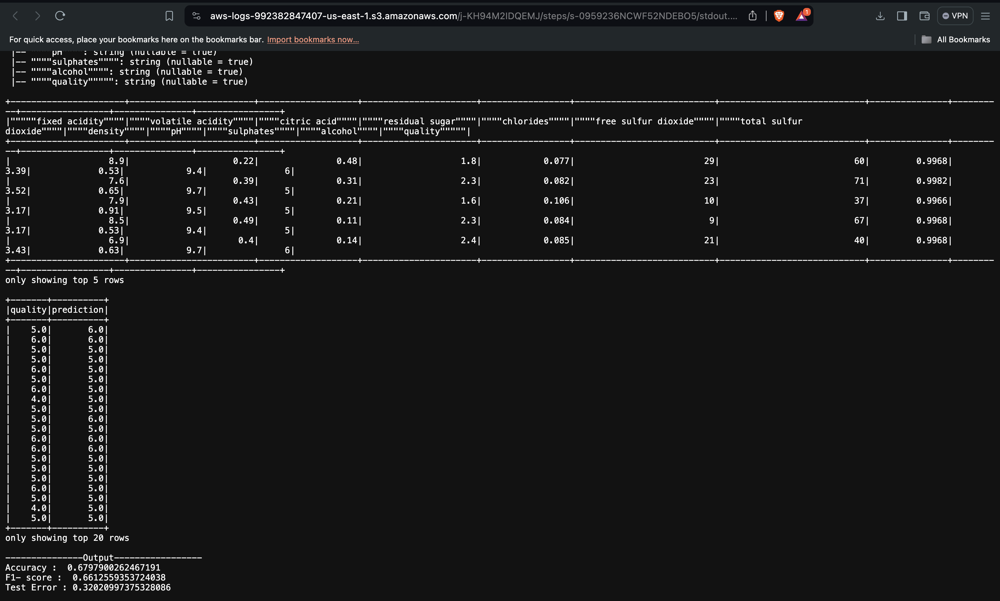
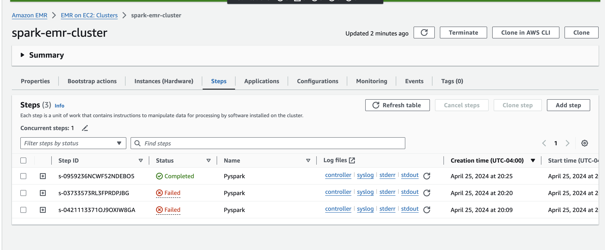
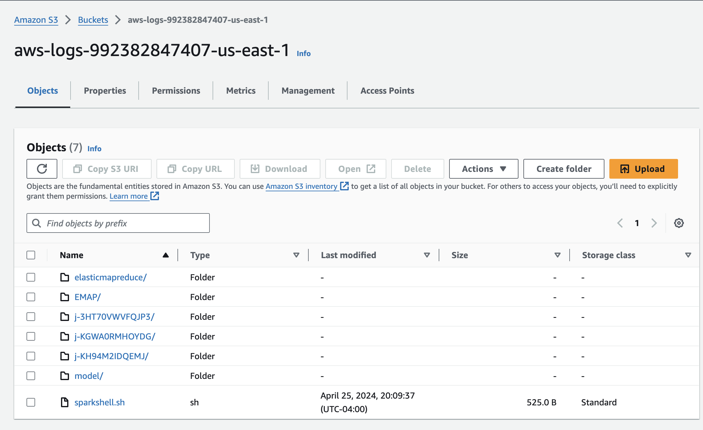
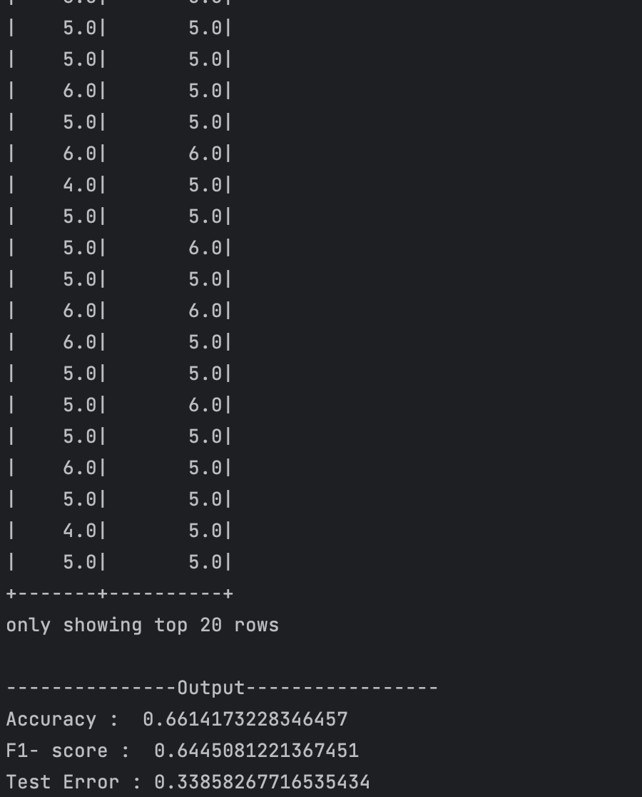
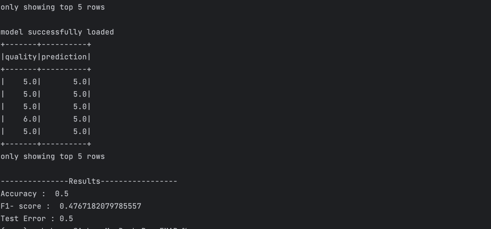

# PySpark Processing on AWS EMR

This repository provides instructions for setting up and running PySpark jobs using Amazon EMR and S3. It is intended to assist users in handling large-scale data processing tasks using Apache Spark in a distributed environment.

## Prerequisites

- An AWS account with appropriate permissions to create EMR clusters, S3 buckets, and EC2 instances.
- AWS CLI installed and configured on your local machine.
- Basic familiarity with Python and Spark.

## Setup Instructions

### 1. S3 Bucket Setup

Ensure your S3 bucket `aws-logs-992382847407-us-east-1` is prepared:

### 2. Prepare Your PySpark Script

Upload your PySpark script and necessary datasets to S3:
aws s3 cp model_training.py s3://aws-logs-992382847407-us-east-1/EMAP/scripts/
aws s3 cp TrainingDataset.csv s3://aws-logs-992382847407-us-east-1/EMAP/data/

### 3. Create an EMR Cluster

Create an EMR cluster with Spark installed using the following command:

 aws emr create-cluster --name spark-emr-cluster --use-default-roles --release-label emr-7.1.0 
 --instance-count 5 --instance-type m5.xlarge --applications Name=JupyterHub Name=Spark Name=Hadoop 
 --ec2-attributes KeyName=emr  --log-uri s3://aws-logs-992382847407-us-east-1
 

### 4. Monitor and Manage the PySpark Job

Monitor your job through the EMR console and access logs at:

s3://aws-logs-992382847407-us-east-1/EMAP/logs/

### 5. Submit Additional Shell Jobs

To submit additional jobs to an existing cluster: use the step function and submit sparkshell.sh

### 6. Verify Outputs

Check the outputs in your designated S3 model output bucket:

aws s3 ls s3://aws-logs-992382847407-us-east-1/model

### 6.To run standalone application :
docker run ks2288/model_training

docker run ks2288/model_prediction

the images are ARM based image 